# 08. 시퀀스 다이어그램

> 서비스 내부 처리 흐름 및 서비스 간 호출 순서 참조
> Drop Service / Order Service는 이미지 중심으로 노션 링크 참조

---

## User Service

### 1. 회원가입

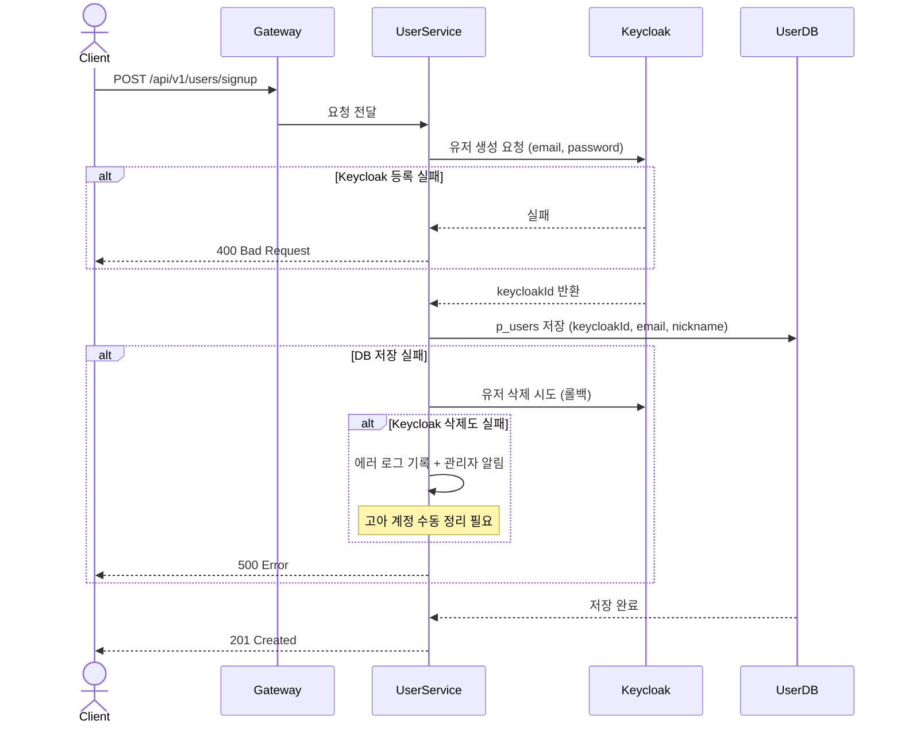
```mermaid
sequenceDiagram
    actor Client
    participant Gateway
    participant UserService
    participant Keycloak
    participant UserDB

    Client->>Gateway: POST /api/v1/users/signup
    Gateway->>UserService: 요청 전달
    UserService->>Keycloak: 유저 생성 요청 (email, password)
    alt Keycloak 등록 실패
        Keycloak-->>UserService: 실패
        UserService-->>Client: 400 Bad Request
    end
    Keycloak-->>UserService: keycloakId 반환
    UserService->>UserDB: p_users 저장 (keycloakId, email, nickname)
    alt DB 저장 실패
        UserService->>Keycloak: 유저 삭제 시도 (롤백)
        alt Keycloak 삭제도 실패
            UserService->>UserService: 에러 로그 기록 + 관리자 알림
            Note over UserService: 고아 계정 수동 정리 필요
        end
        UserService-->>Client: 500 Error
    end
    UserDB-->>UserService: 저장 완료
    UserService-->>Client: 201 Created
```

### 2. 로그인

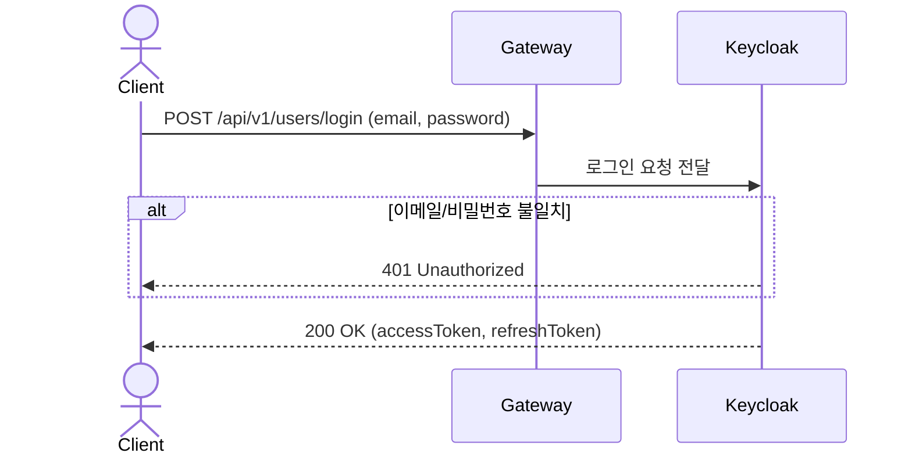
```mermaid
sequenceDiagram
    actor Client
    participant Gateway
    participant Keycloak

    Client->>Gateway: POST /api/v1/users/login (email, password)
    Gateway->>Keycloak: 로그인 요청 전달
    alt 이메일/비밀번호 불일치
        Keycloak-->>Client: 401 Unauthorized
    end
    Keycloak-->>Client: 200 OK (accessToken, refreshToken)
```

### 3. API 인증 흐름 (Gateway JWT 검증)

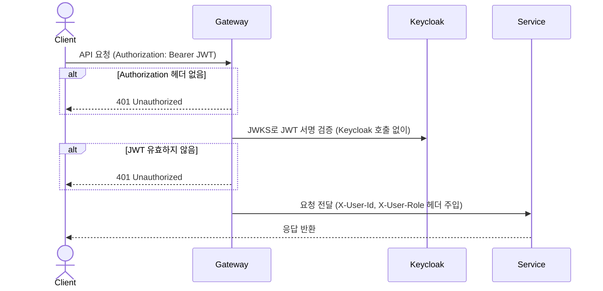
```mermaid
sequenceDiagram
    actor Client
    participant Gateway
    participant Keycloak
    participant Service

    Client->>Gateway: API 요청 (Authorization: Bearer JWT)
    alt Authorization 헤더 없음
        Gateway-->>Client: 401 Unauthorized
    end
    Gateway->>Keycloak: JWKS로 JWT 서명 검증 (Keycloak 호출 없이)
    alt JWT 유효하지 않음
        Gateway-->>Client: 401 Unauthorized
    end
    Gateway->>Service: 요청 전달 (X-User-Id, X-User-Role 헤더 주입)
    Service-->>Client: 응답 반환
```

### 4. 내 프로필 조회

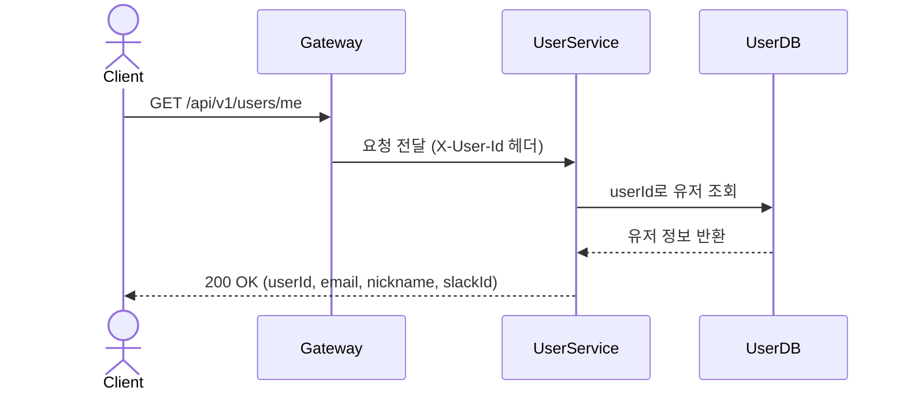
```mermaid
sequenceDiagram
    actor Client
    participant Gateway
    participant UserService
    participant UserDB

    Client->>Gateway: GET /api/v1/users/me
    Gateway->>UserService: 요청 전달 (X-User-Id 헤더)
    UserService->>UserDB: userId로 유저 조회
    UserDB-->>UserService: 유저 정보 반환
    UserService-->>Client: 200 OK (userId, email, nickname, slackId)
```

### 5. 배송지 등록

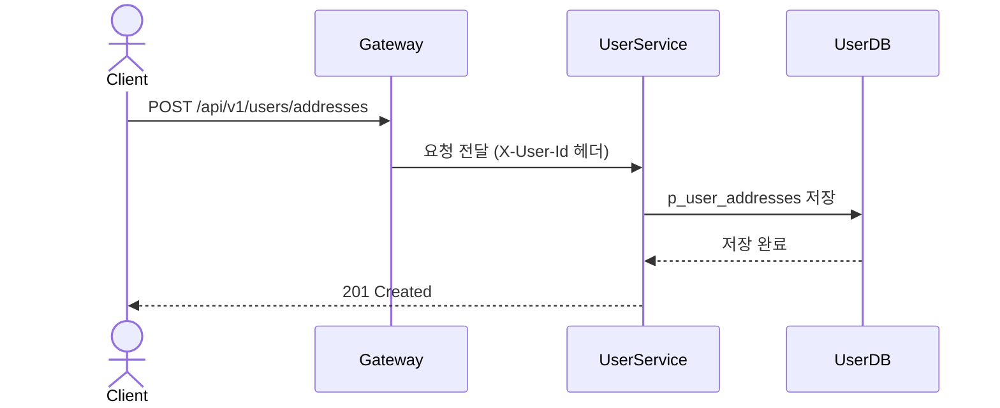
```mermaid
sequenceDiagram
    actor Client
    participant Gateway
    participant UserService
    participant UserDB

    Client->>Gateway: POST /api/v1/users/addresses
    Gateway->>UserService: 요청 전달 (X-User-Id 헤더)
    UserService->>UserDB: p_user_addresses 저장
    UserDB-->>UserService: 저장 완료
    UserService-->>Client: 201 Created
```

---

## Product & Inventory Service

### 1. 상품 등록 (seq_product_create)
- 관리자 상품 등록 시 재고 동시 생성 흐름

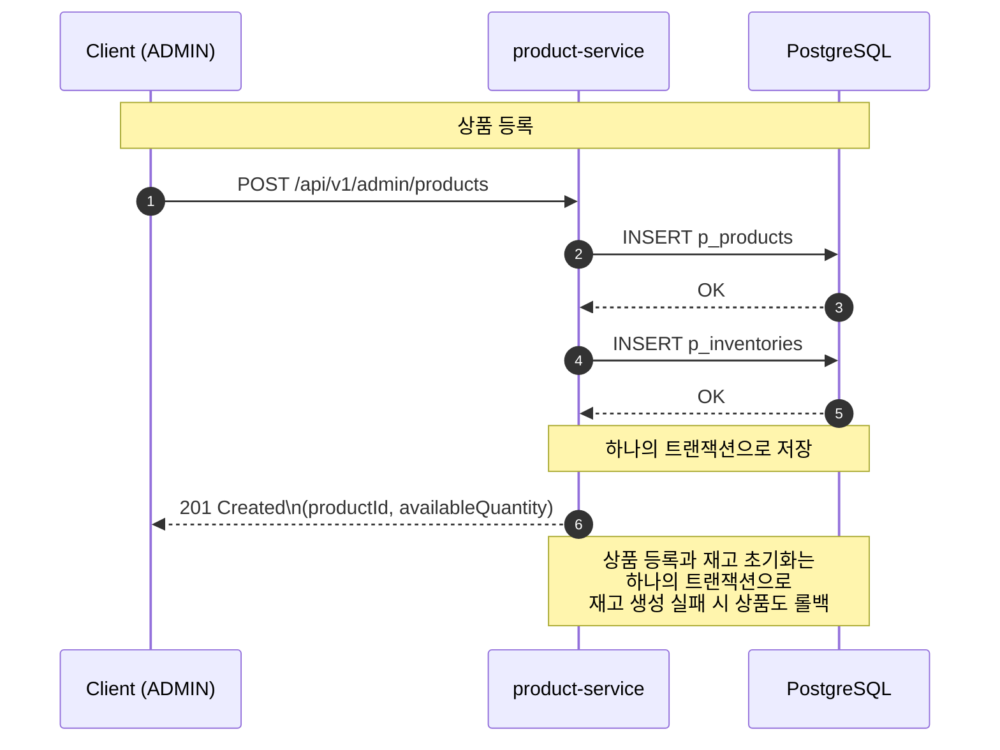
```mermaid
sequenceDiagram
    autonumber

    participant Admin as Client (ADMIN)
    participant Product as product-service
    participant DB as PostgreSQL
    
    Note over Admin,DB: 상품 등록

    Admin->>Product: POST /api/v1/admin/products

    Product->>DB: INSERT p_products
    DB-->>Product: OK

    Product->>DB: INSERT p_inventories
    DB-->>Product: OK
    
    Note over Product,DB: 하나의 트랜잭션으로 저장

    Product-->>Admin: 201 Created\n(productId, availableQuantity)
    
    Note over Product,DB: 상품 등록과 재고 초기화는<br/>하나의 트랜잭션으로<br/>재고 생성 실패 시 상품도 롤백
```

### 2. 상품 수정 (seq_product_update)
- 드롭 활성 여부 확인 후 상품 수정 및 캐시 무효화 흐름

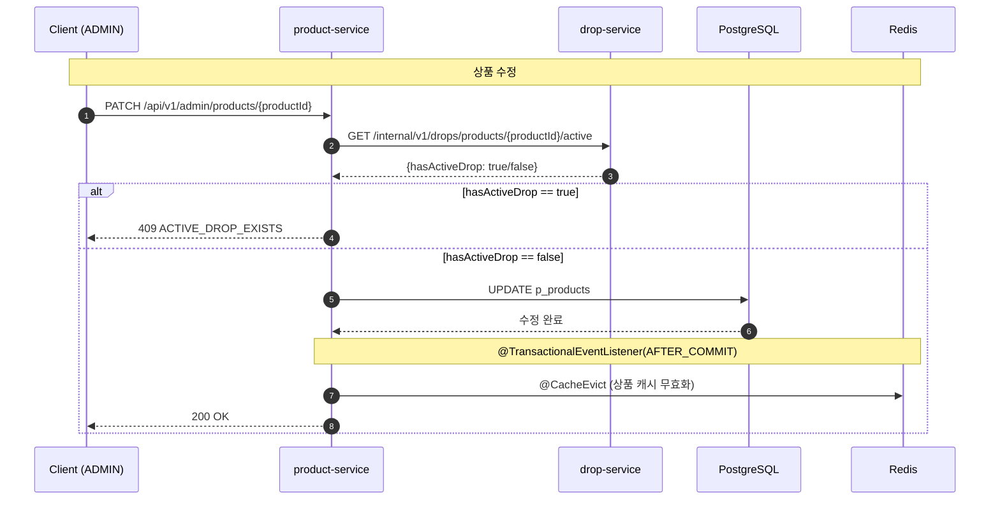
```mermaid
sequenceDiagram
    autonumber

    participant Admin as Client (ADMIN)
    participant Product as product-service
    participant Drop as drop-service
    participant DB as PostgreSQL
    participant Redis

    Note over Admin,Redis: 상품 수정

    Admin->>Product: PATCH /api/v1/admin/products/{productId}

    Product->>Drop: GET /internal/v1/drops/products/{productId}/active
    Drop-->>Product: {hasActiveDrop: true/false}

    alt hasActiveDrop == true
        Product-->>Admin: 409 ACTIVE_DROP_EXISTS
    else hasActiveDrop == false
        Product->>DB: UPDATE p_products
        DB-->>Product: 수정 완료

        Note over Product,Redis: @TransactionalEventListener(AFTER_COMMIT)

        Product->>Redis: @CacheEvict (상품 캐시 무효화)

        Product-->>Admin: 200 OK
    end
```

### 3. 상품 삭제 (seq_product_delete)
- 드롭 활성 여부 확인 후 상품 소프트 삭제 흐름

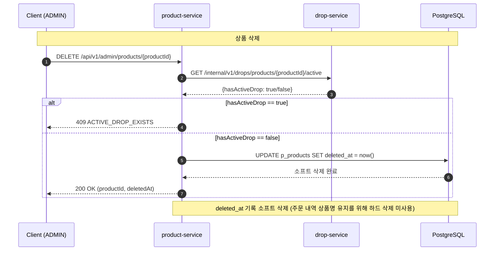
```mermaid
sequenceDiagram
    autonumber

    participant Admin as Client (ADMIN)
    participant Product as product-service
    participant Drop as drop-service
    participant DB as PostgreSQL

    Note over Admin,DB: 상품 삭제

    Admin->>Product: DELETE /api/v1/admin/products/{productId}

    Product->>Drop: GET /internal/v1/drops/products/{productId}/active
    Drop-->>Product: {hasActiveDrop: true/false}

    alt hasActiveDrop == true
        Product-->>Admin: 409 ACTIVE_DROP_EXISTS
    else hasActiveDrop == false
        Product->>DB: UPDATE p_products SET deleted_at = now()
        DB-->>Product: 소프트 삭제 완료
        Product-->>Admin: 200 OK (productId, deletedAt)
    end

    Note over Product,DB: deleted_at 기록 소프트 삭제 (주문 내역 상품명 유지를 위해 하드 삭제 미사용)
```

### 4. 재고 수동 수정 (seq_inventory_update)
- 드롭 활성 여부 확인 후 재고 수량 수동 수정 흐름

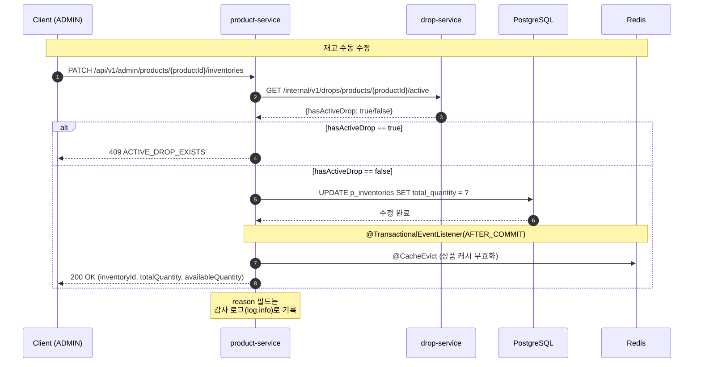
```mermaid
sequenceDiagram
    autonumber

    participant Admin as Client (ADMIN)
    participant Product as product-service
    participant Drop as drop-service
    participant DB as PostgreSQL
    participant Redis

    Note over Admin,Redis: 재고 수동 수정

    Admin->>Product: PATCH /api/v1/admin/products/{productId}/inventories

    Product->>Drop: GET /internal/v1/drops/products/{productId}/active
    Drop-->>Product: {hasActiveDrop: true/false}

    alt hasActiveDrop == true
        Product-->>Admin: 409 ACTIVE_DROP_EXISTS

    else hasActiveDrop == false
        Product->>DB: UPDATE p_inventories SET total_quantity = ?
        DB-->>Product: 수정 완료
        
        Note over Product,Redis: @TransactionalEventListener(AFTER_COMMIT)

        Product->>Redis: @CacheEvict (상품 캐시 무효화)
        
        Product-->>Admin: 200 OK (inventoryId, totalQuantity, availableQuantity)
        
    end

    Note over Product: reason 필드는<br>감사 로그(log.info)로 기록
```

### 5. 재고 확정 차감 (seq_stock_confirm)
- `payment.completed` 수신 후 재고 차감 및 SAGA 보상 흐름

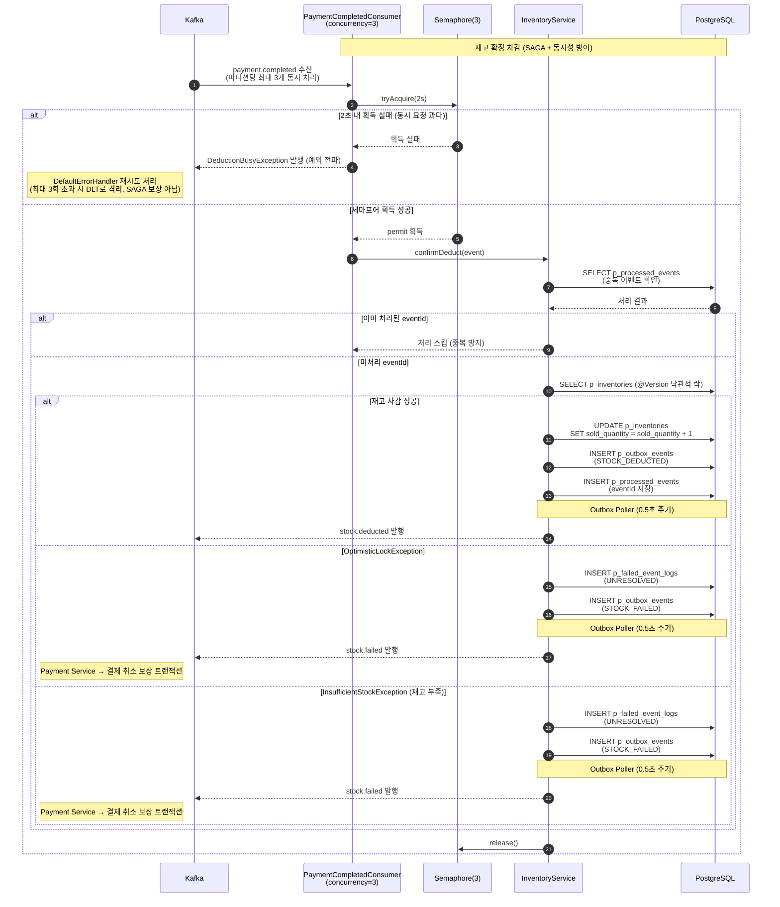
```mermaid
sequenceDiagram
    autonumber

    participant K as Kafka
    participant C as PaymentCompletedConsumer<br/>(concurrency=3)
    participant S as Semaphore(3)
    participant I as InventoryService
    participant DB as PostgreSQL

    Note over C,DB: 재고 확정 차감 (SAGA + 동시성 방어)

    K->>C: payment.completed 수신<br/>(파티션당 최대 3개 동시 처리)
    C->>S: tryAcquire(2s)

    alt 2초 내 획득 실패 (동시 요청 과다)
        S-->>C: 획득 실패
        C-->>K: DeductionBusyException 발생 (예외 전파)

        Note left of K: DefaultErrorHandler 재시도 처리<br/>(최대 3회 초과 시 DLT로 격리, SAGA 보상 아님)

    else 세마포어 획득 성공
        S-->>C: permit 획득

        C->>I: confirmDeduct(event)

        I->>DB: SELECT p_processed_events<br/>(중복 이벤트 확인)
        DB-->>I: 처리 결과

        alt 이미 처리된 eventId
            I-->>C: 처리 스킵 (중복 방지)

        else 미처리 eventId
            I->>DB: SELECT p_inventories (@Version 낙관적 락)

            alt 재고 차감 성공
                I->>DB: UPDATE p_inventories<br/>SET sold_quantity = sold_quantity + 1
                I->>DB: INSERT p_outbox_events<br/>(STOCK_DEDUCTED)
                I->>DB: INSERT p_processed_events<br/>(eventId 저장)

                Note over I,DB: Outbox Poller (0.5초 주기)

                I-->>K: stock.deducted 발행

            else OptimisticLockException
                I->>DB: INSERT p_failed_event_logs<br/>(UNRESOLVED)
                I->>DB: INSERT p_outbox_events<br/>(STOCK_FAILED)

                Note over I,DB: Outbox Poller (0.5초 주기)

                I-->>K: stock.failed 발행

                Note left of K: Payment Service → 결제 취소 보상 트랜잭션

            else InsufficientStockException (재고 부족)
                I->>DB: INSERT p_failed_event_logs<br/>(UNRESOLVED)
                I->>DB: INSERT p_outbox_events<br/>(STOCK_FAILED)

                Note over I,DB: Outbox Poller (0.5초 주기)

                I-->>K: stock.failed 발행

                Note left of K: Payment Service → 결제 취소 보상 트랜잭션
            end
        end

        I->>S: release()
    end
```
> Semaphore·DLT 도입 배경(HikariCP 커넥션 고갈 트러블슈팅)은 SA 문서 16.3 참고

---

## Order Service

> 이미지 중심으로 노션 페이지 참조:
> https://app.notion.com/p/3afa52c1236782e3806b8143d9bc0dcd

- DROP 주문 생성 → PAID → CONFIRMED
- Case A (타임아웃 / 결제 실패)
- RAFFLE 당첨 시 CONFIRMED 직행
- 배송 스케줄러 + 환불 (REFUND_REQUESTED 경유)

---

## Payment Service

### 결제 생성 ~ PG 승인

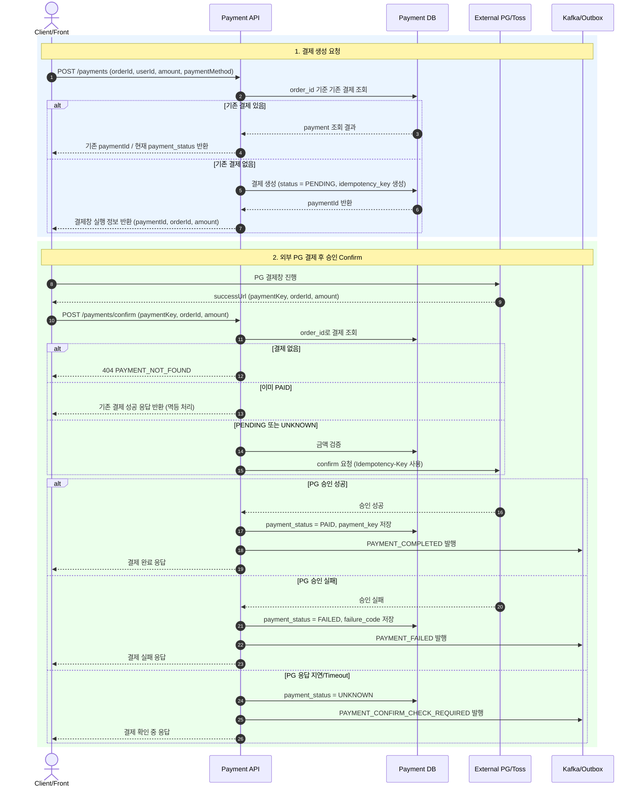
```mermaid
sequenceDiagram
    autonumber

    actor Client as Client/Front
    participant PaymentAPI as Payment API
    participant PaymentDB as Payment DB
    participant PG as External PG/Toss
    participant Kafka as Kafka/Outbox

    rect rgb(235, 245, 255)
    Note over Client,Kafka: 1. 결제 생성 요청

    Client->>PaymentAPI: POST /payments (orderId, userId, amount, paymentMethod)
    PaymentAPI->>PaymentDB: order_id 기준 기존 결제 조회

    alt 기존 결제 있음
        PaymentDB-->>PaymentAPI: payment 조회 결과
        PaymentAPI-->>Client: 기존 paymentId / 현재 payment_status 반환
    else 기존 결제 없음
        PaymentAPI->>PaymentDB: 결제 생성 (status = PENDING, idempotency_key 생성)
        PaymentDB-->>PaymentAPI: paymentId 반환
        PaymentAPI-->>Client: 결제창 실행 정보 반환 (paymentId, orderId, amount)
    end
    end

    rect rgb(235, 255, 235)
    Note over Client,Kafka: 2. 외부 PG 결제 후 승인 Confirm

    Client->>PG: PG 결제창 진행
    PG-->>Client: successUrl (paymentKey, orderId, amount)

    Client->>PaymentAPI: POST /payments/confirm (paymentKey, orderId, amount)
    PaymentAPI->>PaymentDB: order_id로 결제 조회

    alt 결제 없음
        PaymentAPI-->>Client: 404 PAYMENT_NOT_FOUND
    else 이미 PAID
        PaymentAPI-->>Client: 기존 결제 성공 응답 반환 (멱등 처리)
    else PENDING 또는 UNKNOWN
        PaymentAPI->>PaymentDB: 금액 검증
        PaymentAPI->>PG: confirm 요청 (Idempotency-Key 사용)
    end

    alt PG 승인 성공
        PG-->>PaymentAPI: 승인 성공
        PaymentAPI->>PaymentDB: payment_status = PAID, payment_key 저장
        PaymentAPI->>Kafka: PAYMENT_COMPLETED 발행
        PaymentAPI-->>Client: 결제 완료 응답
    else PG 승인 실패
        PG-->>PaymentAPI: 승인 실패
        PaymentAPI->>PaymentDB: payment_status = FAILED, failure_code 저장
        PaymentAPI->>Kafka: PAYMENT_FAILED 발행
        PaymentAPI-->>Client: 결제 실패 응답
    else PG 응답 지연/Timeout
        PaymentAPI->>PaymentDB: payment_status = UNKNOWN
        PaymentAPI->>Kafka: PAYMENT_CONFIRM_CHECK_REQUIRED 발행
        PaymentAPI-->>Client: 결제 확인 중 응답
    end
    end
```

---

## Coupon Service

### 1. 쿠폰 생성 (관리자)

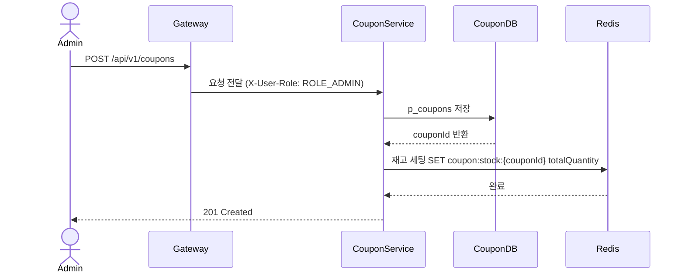
```mermaid
sequenceDiagram
    actor Admin
    participant Gateway
    participant CouponService
    participant CouponDB
    participant Redis

    Admin->>Gateway: POST /api/v1/coupons
    Gateway->>CouponService: 요청 전달 (X-User-Role: ROLE_ADMIN)
    CouponService->>CouponDB: p_coupons 저장
    CouponDB-->>CouponService: couponId 반환
    CouponService->>Redis: 재고 세팅 SET coupon:stock:{couponId} totalQuantity
    Redis-->>CouponService: 완료
    CouponService-->>Admin: 201 Created
```

### 2. 선착순 쿠폰 발급

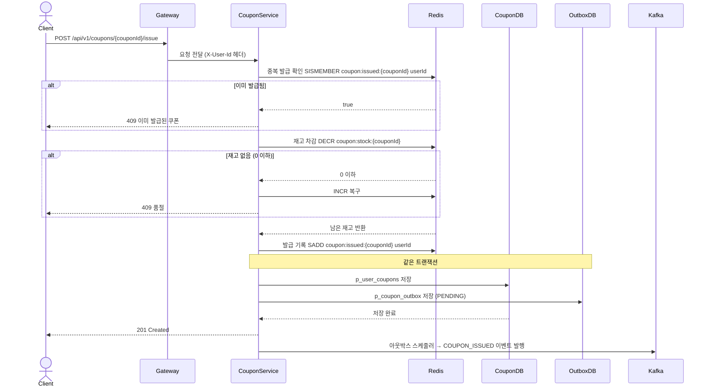
```mermaid
sequenceDiagram
    actor Client
    participant Gateway
    participant CouponService
    participant Redis
    participant CouponDB
    participant OutboxDB
    participant Kafka

    Client->>Gateway: POST /api/v1/coupons/{couponId}/issue
    Gateway->>CouponService: 요청 전달 (X-User-Id 헤더)
    CouponService->>Redis: 중복 발급 확인 SISMEMBER coupon:issued:{couponId} userId
    alt 이미 발급됨
        Redis-->>CouponService: true
        CouponService-->>Client: 409 이미 발급된 쿠폰
    end
    CouponService->>Redis: 재고 차감 DECR coupon:stock:{couponId}
    alt 재고 없음 (0 이하)
        Redis-->>CouponService: 0 이하
        CouponService->>Redis: INCR 복구
        CouponService-->>Client: 409 품절
    end
    Redis-->>CouponService: 남은 재고 반환
    CouponService->>Redis: 발급 기록 SADD coupon:issued:{couponId} userId
    Note over CouponService,OutboxDB: 같은 트랜잭션
    CouponService->>CouponDB: p_user_coupons 저장
    CouponService->>OutboxDB: p_coupon_outbox 저장 (PENDING)
    CouponDB-->>CouponService: 저장 완료
    CouponService-->>Client: 201 Created
    CouponService->>Kafka: 아웃박스 스케줄러 → COUPON_ISSUED 이벤트 발행
```

### 3. 결제 시 쿠폰 선점 (INTERNAL)

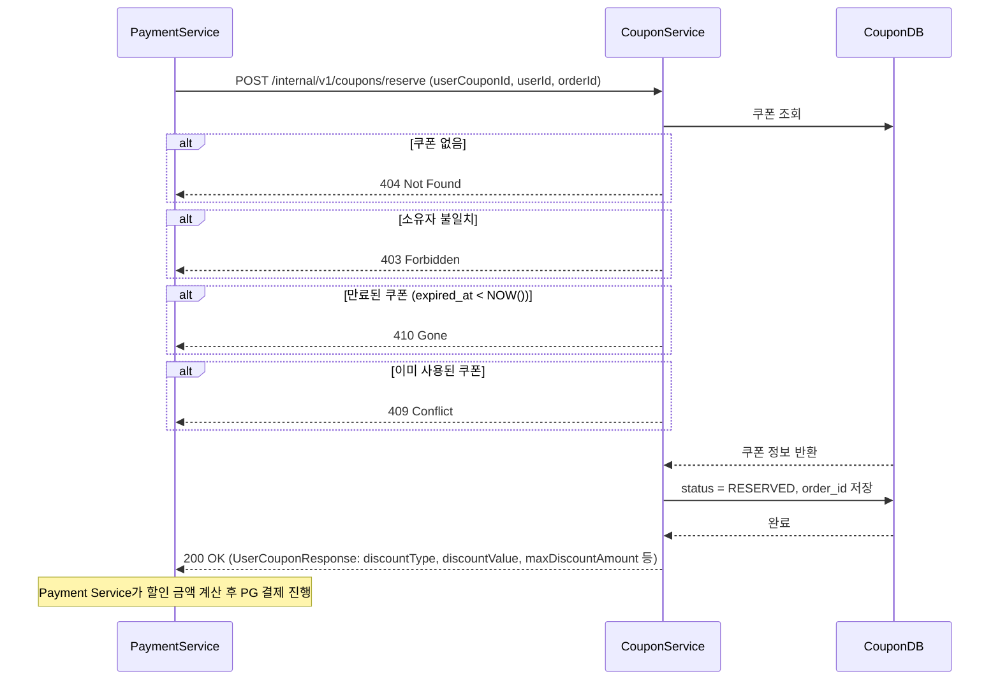
```mermaid
sequenceDiagram
    participant PaymentService
    participant CouponService
    participant CouponDB

    PaymentService->>CouponService: POST /internal/v1/coupons/reserve (userCouponId, userId, orderId)
    CouponService->>CouponDB: 쿠폰 조회
    alt 쿠폰 없음
        CouponService-->>PaymentService: 404 Not Found
    end
    alt 소유자 불일치
        CouponService-->>PaymentService: 403 Forbidden
    end
    alt 만료된 쿠폰 (expired_at < NOW())
        CouponService-->>PaymentService: 410 Gone
    end
    alt 이미 사용된 쿠폰
        CouponService-->>PaymentService: 409 Conflict
    end
    CouponDB-->>CouponService: 쿠폰 정보 반환
    CouponService->>CouponDB: status = RESERVED, order_id 저장
    CouponDB-->>CouponService: 완료
    CouponService-->>PaymentService: 200 OK (UserCouponResponse: discountType, discountValue, maxDiscountAmount 등)
    Note over PaymentService: Payment Service가 할인 금액 계산 후 PG 결제 진행
```

### 4. 쿠폰 복구 (SAGA 보상 트랜잭션)

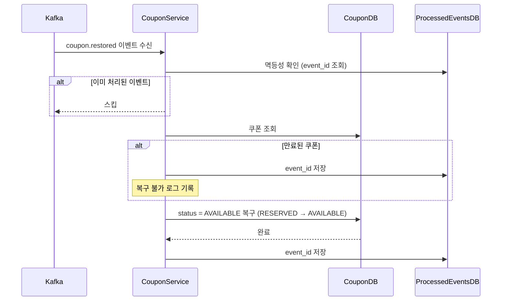
```mermaid
sequenceDiagram
    participant Kafka
    participant CouponService
    participant CouponDB
    participant ProcessedEventsDB

    Kafka->>CouponService: coupon.restored 이벤트 수신
    CouponService->>ProcessedEventsDB: 멱등성 확인 (event_id 조회)
    alt 이미 처리된 이벤트
        CouponService-->>Kafka: 스킵
    end
    CouponService->>CouponDB: 쿠폰 조회
    alt 만료된 쿠폰
        CouponService->>ProcessedEventsDB: event_id 저장
        Note over CouponService: 복구 불가 로그 기록
    end
    CouponService->>CouponDB: status = AVAILABLE 복구 (RESERVED → AVAILABLE)
    CouponDB-->>CouponService: 완료
    CouponService->>ProcessedEventsDB: event_id 저장
```

### 5. 만료 스케줄러

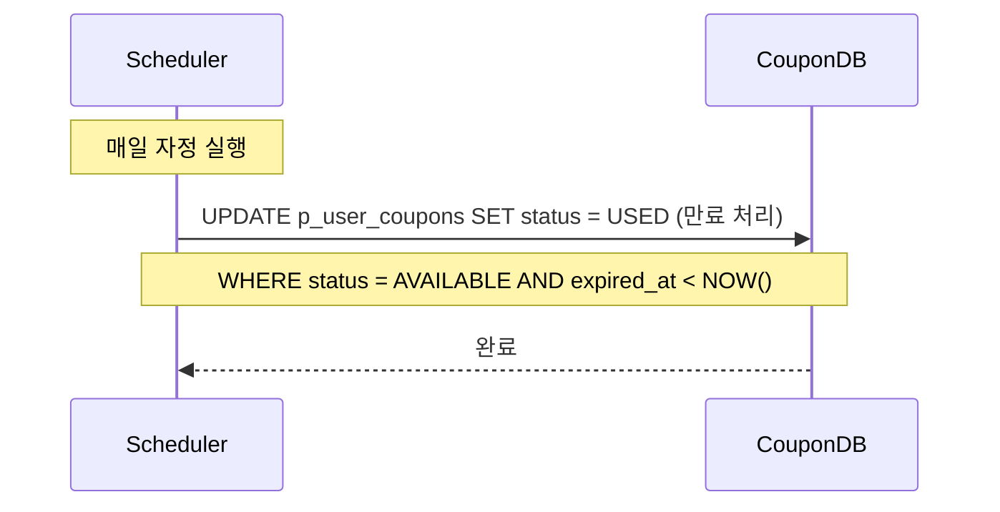
```mermaid
sequenceDiagram
    participant Scheduler
    participant CouponDB

    Note over Scheduler: 매일 자정 실행
    Scheduler->>CouponDB: UPDATE p_user_coupons SET status = USED (만료 처리)
    Note over Scheduler,CouponDB: WHERE status = AVAILABLE AND expired_at < NOW()
    CouponDB-->>Scheduler: 완료
```

### 6. Redis 복구 (서버 재시작 시)

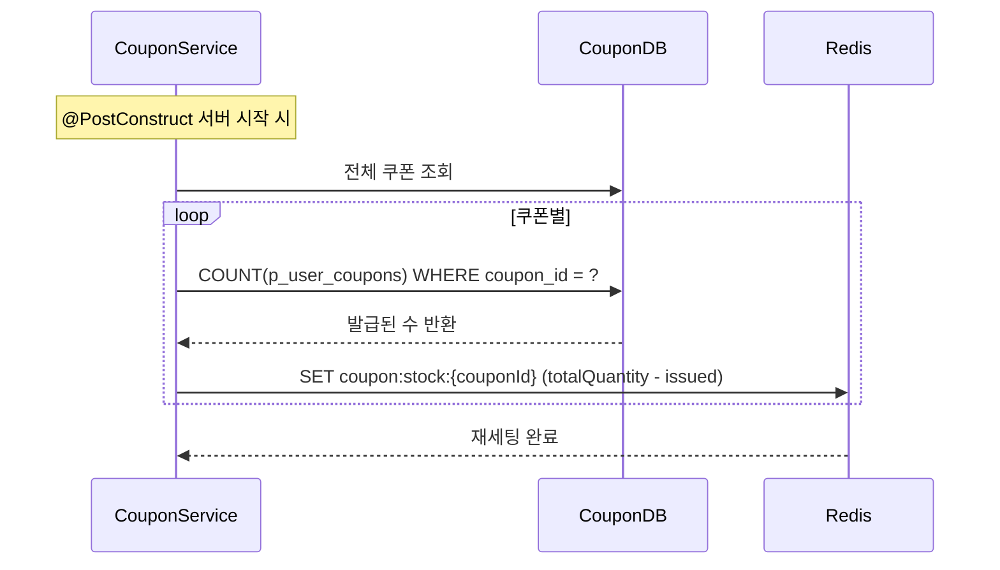
```mermaid
sequenceDiagram
    participant CouponService
    participant CouponDB
    participant Redis

    Note over CouponService: @PostConstruct 서버 시작 시
    CouponService->>CouponDB: 전체 쿠폰 조회
    loop 쿠폰별
        CouponService->>CouponDB: COUNT(p_user_coupons) WHERE coupon_id = ?
        CouponDB-->>CouponService: 발급된 수 반환
        CouponService->>Redis: SET coupon:stock:{couponId} (totalQuantity - issued)
    end
    Redis-->>CouponService: 재세팅 완료
```

---

## Notification Service

### 1. 공통 알림 처리 흐름

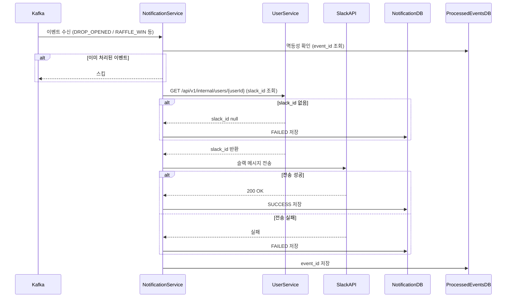
```mermaid
sequenceDiagram
    participant Kafka
    participant NotificationService
    participant UserService
    participant SlackAPI
    participant NotificationDB
    participant ProcessedEventsDB

    Kafka->>NotificationService: 이벤트 수신 (DROP_OPENED / RAFFLE_WIN 등)
    NotificationService->>ProcessedEventsDB: 멱등성 확인 (event_id 조회)
    alt 이미 처리된 이벤트
        NotificationService-->>Kafka: 스킵
    end
    NotificationService->>UserService: GET /api/v1/internal/users/{userId} (slack_id 조회)
    alt slack_id 없음
        UserService-->>NotificationService: slack_id null
        NotificationService->>NotificationDB: FAILED 저장
    end
    UserService-->>NotificationService: slack_id 반환
    NotificationService->>SlackAPI: 슬랙 메시지 전송
    alt 전송 성공
        SlackAPI-->>NotificationService: 200 OK
        NotificationService->>NotificationDB: SUCCESS 저장
    else 전송 실패
        SlackAPI-->>NotificationService: 실패
        NotificationService->>NotificationDB: FAILED 저장
    end
    NotificationService->>ProcessedEventsDB: event_id 저장
```

### 2. 실패 알림 재시도 스케줄러

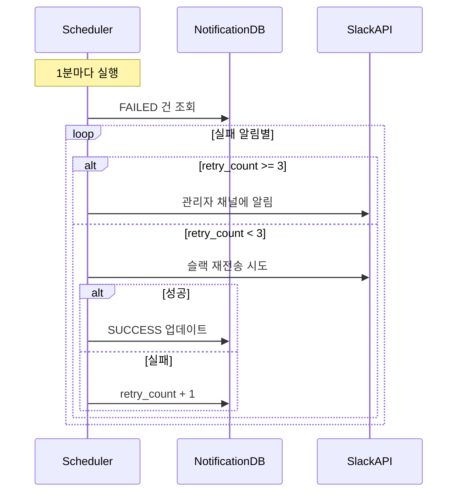
```mermaid
sequenceDiagram
    participant Scheduler
    participant NotificationDB
    participant SlackAPI

    Note over Scheduler: 1분마다 실행
    Scheduler->>NotificationDB: FAILED 건 조회
    loop 실패 알림별
        alt retry_count >= 3
            Scheduler->>SlackAPI: 관리자 채널에 알림
        else retry_count < 3
            Scheduler->>SlackAPI: 슬랙 재전송 시도
            alt 성공
                Scheduler->>NotificationDB: SUCCESS 업데이트
            else 실패
                Scheduler->>NotificationDB: retry_count + 1
            end
        end
    end
```

### 3. 이벤트별 알림 내용

| 이벤트 | 알림 메시지 |
|---|---|
| DROP_OPENED | [드롭 오픈] 지금 바로 구매하세요! |
| RAFFLE_WIN | [당첨] 축하합니다! 24시간 내 결제해주세요 |
| ORDER_CONFIRMED | [주문완료] 주문이 확정됐어요 |
| PAYMENT_FAILED | [결제실패] 결제에 실패했어요. 다시 시도해주세요 |
| REFUND_DONE | [환불완료] 환불이 처리됐어요 |

---

## Drop Service

> 이미지 중심으로 노션 페이지 참조:
> https://app.notion.com/p/10ba52c12367837bad65014d38a0b19e

- 드롭 상태 전이 (오픈 + 마감)
- 선착순 진입 → 쿠폰 → 결제 → 확정
- 회수·복구 (SAGA 보상)

### 1. 구매선점 (purchase.lua 원자 실행 + DB Outbox 저장)

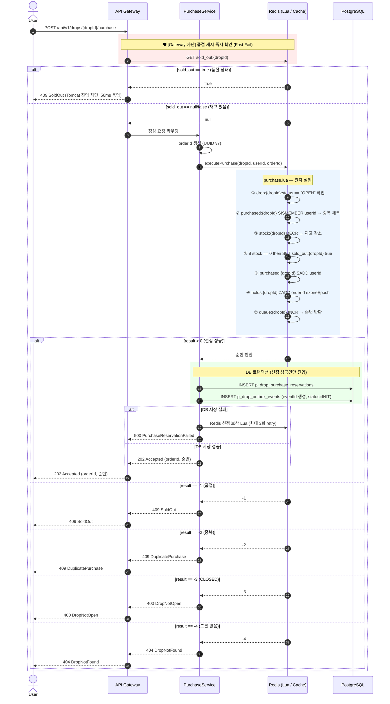
```mermaid
sequenceDiagram
    autonumber
    actor User
    participant Gateway as API Gateway
    participant PurchaseService
    participant Redis as Redis (Lua / Cache)
    participant DB as PostgreSQL

    User->>Gateway: POST /api/v1/drops/{dropId}/purchase

    rect rgb(255, 235, 235)
    Note over Gateway,Redis: 🛡️ [Gateway 차단] 품절 캐시 즉시 확인 (Fast Fail)
    Gateway->>Redis: GET sold_out:{dropId}
    end

    alt sold_out == true (품절 상태)
        Redis-->>Gateway: true
        Gateway-->>User: 409 SoldOut (Tomcat 진입 차단, 56ms 응답)
    else sold_out == null/false (재고 있음)
        Redis-->>Gateway: null
        Gateway->>PurchaseService: 정상 요청 라우팅

        PurchaseService->>PurchaseService: orderId 생성 (UUID v7)
        PurchaseService->>Redis: executePurchase(dropId, userId, orderId)

        rect rgb(235, 245, 255)
        Note over Redis: purchase.lua — 원자 실행
        Redis->>Redis: ① drop:{dropId}:status == "OPEN" 확인
        Redis->>Redis: ② purchased:{dropId} SISMEMBER userId → 중복 체크
        Redis->>Redis: ③ stock:{dropId} DECR → 재고 감소
        Redis->>Redis: ④ if stock == 0 then SET sold_out:{dropId} true
        Redis->>Redis: ⑤ purchased:{dropId} SADD userId
        Redis->>Redis: ⑥ holds:{dropId} ZADD orderId expireEpoch
        Redis->>Redis: ⑦ queue:{dropId} INCR → 순번 반환
        end

        alt result > 0 (선점 성공)
            Redis-->>PurchaseService: 순번 반환

            rect rgb(235, 255, 235)
            Note over PurchaseService,DB: DB 트랜잭션 (선점 성공건만 진입)
            PurchaseService->>DB: INSERT p_drop_purchase_reservations
            PurchaseService->>DB: INSERT p_drop_outbox_events (eventId 생성, status=INIT)
            end

            alt DB 저장 실패
                PurchaseService->>Redis: Redis 선점 보상 Lua (최대 3회 retry)
                PurchaseService-->>Gateway: 500 PurchaseReservationFailed
            else DB 저장 성공
                PurchaseService-->>Gateway: 202 Accepted (orderId, 순번)
            end

            Gateway-->>User: 202 Accepted (orderId, 순번)
        else result == -1 (품절)
            Redis-->>PurchaseService: -1
            PurchaseService-->>Gateway: 409 SoldOut
            Gateway-->>User: 409 SoldOut
        else result == -2 (중복)
            Redis-->>PurchaseService: -2
            PurchaseService-->>Gateway: 409 DuplicatePurchase
            Gateway-->>User: 409 DuplicatePurchase
        else result == -3 (CLOSED)
            Redis-->>PurchaseService: -3
            PurchaseService-->>Gateway: 400 DropNotOpen
            Gateway-->>User: 400 DropNotOpen
        else result == -4 (드롭 없음)
            Redis-->>PurchaseService: -4
            PurchaseService-->>Gateway: 404 DropNotFound
            Gateway-->>User: 404 DropNotFound
        end
    end
```

### 2. DB Outbox Poller (purchase.confirmed 발행)

```mermaid
sequenceDiagram
    autonumber
    participant Poller as DropOutboxPoller
    participant DB as PostgreSQL
    participant Kafka

    loop 2초 fixedRate (@Scheduled)
        Poller->>DB: SELECT * FROM p_drop_outbox_events WHERE status='INIT' ORDER BY created_at LIMIT 100 FOR UPDATE SKIP LOCKED
        DB-->>Poller: INIT 이벤트 목록
    end

    loop 각 이벤트
        Poller->>Kafka: kafkaTemplate.send("purchase.confirmed", orderId, payload)

        alt 발행 성공
            Kafka-->>Poller: 성공 콜백
            Poller->>DB: UPDATE status = PUBLISHED, published_at = now()
        else 발행 실패
            Kafka-->>Poller: 실패 콜백
            Poller->>DB: UPDATE retry_count + 1
            Note over Poller,DB: retry_count >= 5 → status = FAILED (격리, 수동 재처리)
        end
    end
```

### 6. 드롭 자동 오픈 (DropStatusScheduler)

```mermaid
sequenceDiagram
    autonumber
    participant Scheduler as DropStatusScheduler (5초 주기)
    participant DB as PostgreSQL
    participant ProductService
    participant Redis
    participant Kafka

    Scheduler->>DB: findByStatusAndStartAtLessThanEqual(SCHEDULED, now)
    DB-->>Scheduler: 오픈 대상 드롭 목록

    loop 드롭별
        Scheduler->>ProductService: GET /internal/products/{productId}/inventory-snapshot
        alt product-service 응답 성공
            ProductService-->>Scheduler: availableQuantity
        else 응답 실패 (타임아웃 등)
            Note over Scheduler: totalQty 폴백 사용 + 메트릭 기록
        end

        Scheduler->>DB: updateStatusConditionally(SCHEDULED → OPEN)
        alt updated == 1 (내가 먼저 처리)
            Scheduler->>Redis: warmup(dropId, qty, holdTtlSec, productId)
            Note over Redis: stock, hold_ttl, product_id, status 세팅
            Scheduler->>Redis: addOpenDrop(dropId)
            Note over Redis: open_drops Set에 추가
            Scheduler->>Kafka: drop.opened 발행
        else updated == 0 (다른 인스턴스가 먼저 처리)
            Note over Scheduler: 스킵
        end
    end
```

### 7. 드롭 자동 마감 (DropStatusScheduler)

```mermaid
sequenceDiagram
    autonumber
    participant Scheduler as DropStatusScheduler (5초 주기)
    participant DB as PostgreSQL
    participant Redis
    participant Kafka

    Scheduler->>DB: findByStatusAndEndAtLessThanEqual(OPEN, now)
    DB-->>Scheduler: 마감 대상 드롭 목록

    loop 드롭별
        Scheduler->>Redis: deleteStatus(dropId)
        Note over Redis: status:{dropId} 삭제 → 신규 구매 즉시 차단

        Scheduler->>DB: updateStatusConditionally(OPEN → CLOSED)
        alt updated == 1
            Scheduler->>Kafka: drop.closed 발행
        else updated == 0 (다른 인스턴스가 먼저 처리)
            Note over Scheduler: 스킵
        end
    end
```

### 8. Hold TTL 만료 처리 (HoldExpireScheduler)

```mermaid
sequenceDiagram
    autonumber
    participant Scheduler as HoldExpireScheduler (10초 주기)
    participant Redis
    participant DB as PostgreSQL
    participant Kafka

    Scheduler->>Redis: getOpenDropIds() — open_drops Set 조회

    alt open_drops 비어있음 (Redis 재시작 등)
        Note over Scheduler: recoverFromDb() 실행
        Scheduler->>DB: findByStatus(OPEN)
        DB-->>Scheduler: OPEN 드롭 목록
        Scheduler->>Redis: addOpenDrop (복구)
        Scheduler->>DB: findByStatusAndEndAtGreaterThanEqual(CLOSED, now-2일)
        DB-->>Scheduler: 최근 CLOSED 드롭 목록
        loop holds 남은 CLOSED 드롭
            Scheduler->>Redis: addOpenDrop (holds 정리 대상)
        end
    end

    loop 드롭별
        Scheduler->>Redis: getExpiredOrderIds(dropId, nowEpoch)
        Note over Redis: holds:{dropId} ZSet에서 score <= nowEpoch 조회

        loop 만료 orderId별
            Scheduler->>Redis: expireHold(dropId, orderId)
            Note over Redis: expire.lua — holds ZREM + stock INCR
            alt removed == 1 (내가 먼저 처리)
                Scheduler->>Kafka: hold.expired 발행
            else removed == 0 (다른 인스턴스가 먼저 처리)
                Note over Scheduler: 스킵
            end
        end

        alt isOpen==false && isHoldsEmpty==true
            Scheduler->>Redis: removeOpenDrop(dropId)
            Note over Redis: CLOSED + holds 비었으면 open_drops에서 제거
        end
    end
```

### 9. 결제 결과 수신 후 Hold 처리 (DropEventConsumer)

```mermaid
sequenceDiagram
    autonumber
    participant Kafka
    participant Consumer as DropEventConsumer
    participant ProcessedEventDB as p_drop_processed_events
    participant Redis
    participant KafkaOut as Kafka (발행)

    alt payment.completed 수신
        Kafka->>Consumer: payment.completed
        Consumer->>Consumer: salesType == "DROP" 확인 (RAFFLE면 스킵)
        Consumer->>ProcessedEventDB: INSERT eventId (중복 방지)
        alt 이미 처리된 eventId (PK 충돌)
            Note over Consumer: 스킵
        end

        Consumer->>Redis: removeHold(dropId, orderId)
        Note over Redis: holds:{dropId} ZREM orderId

        alt removed == 0 (hold 이미 만료됨)
            Note over Consumer: TTL 만료 후 결제 완료 → 환불 필요
            Consumer->>KafkaOut: refund.requested 발행
        else removed == 1
            Note over Consumer: 정상 확정 완료
        end

    else payment.failed 수신
        Kafka->>Consumer: payment.failed
        Consumer->>Consumer: salesType == "DROP" 확인
        Consumer->>ProcessedEventDB: INSERT eventId
        Consumer->>Redis: recoverStock(dropId, orderId, userId)
        Note over Redis: recovery.lua — holds ZREM + purchased SREM + stock INCR

    else stock.failed 수신
        Kafka->>Consumer: stock.failed
        Consumer->>ProcessedEventDB: INSERT eventId
        Consumer->>Redis: recoverStock(dropId, orderId, userId)
        Note over Redis: recovery.lua — 동일하게 선점 복구
    end
```

### 10. 마감 후 Redis 키 정리 (DropRedisCleanupScheduler)

```mermaid
sequenceDiagram
    autonumber
    participant Scheduler as DropRedisCleanupScheduler (60초 주기)
    participant DB as PostgreSQL
    participant Redis

    Scheduler->>DB: findByStatusAndEndAtGreaterThanEqual(CLOSED, now-2일)
    DB-->>Scheduler: 최근 CLOSED 드롭 목록

    loop 드롭별
        Scheduler->>Redis: isHoldsEmpty(dropId)
        alt holds 남아있음 OR endAt+1시간 미경과
            Note over Scheduler: 스킵 (아직 정리 불가)
        else holds 비었음 AND endAt+1시간 경과
            Scheduler->>Redis: deleteDropKeys(dropId)
            Note over Redis: stock, purchased, holds, hold_ttl, product_id, status 일괄 삭제
        end
    end
```

---

## Raffle Service

### 1. 래플 응모 (빌링키 등록 및 가승인)

```mermaid
sequenceDiagram
    autonumber
    actor User as 사용자
    participant Raffle as 래플 서비스
    participant Redis as Redis
    participant Payment as 결제 서비스
    participant DB as 래플 DB

    User->>Raffle: 1. 래플 응모 요청 (Drop ID, 카드 정보 등)
    Raffle->>Redis: 2. 중복 검증 (SADD raffle:{id}:entries {user_id})

    alt 중복 응모 (SADD = 0)
        Redis-->>Raffle: 0 반환 (이미 존재함)
        Raffle-->>User: 400 ALREADY_ENTERED 예외 반환
    else 신규 응모 (SADD = 1)
        Redis-->>Raffle: 1 반환 (등록 성공)
        Raffle->>Payment: 3. 카드 유효성 검증(가승인) API 동기 호출 (OpenFeign)

        alt 검증 실패 (한도 초과/정지 카드)
            Payment-->>Raffle: 검증 실패 에러 응답
            Raffle->>Redis: 4. SREM (Redis 선점 데이터 삭제 → 재응모 허용)
            Raffle-->>User: 결제 수단 유효성 에러 안내 (응모 거부)
        else 검증 성공
            Payment->>Payment: 5. 빌링키(Billing Key) 발급 및 DB 저장
            Payment-->>Raffle: 200 빌링키 ID 반환
            Raffle->>DB: 6. p_raffle_entries 응모 이력 INSERT (billing_key_id 포함)
            Raffle-->>User: 200 래플 응모 완료 (결제 대기 상태)
        end
    end
```

### 2. 응모 마감 및 추첨 실행

```mermaid
sequenceDiagram
    autonumber
    participant Scheduler as 추첨 스케줄러
    participant Raffle as 래플 서비스
    participant DB as 래플 DB

    Scheduler->>Raffle: 1. 마감 시간 도래, 추첨 로직 트리거
    Raffle->>DB: 2. 해당 래플의 전체 응모자 UUID 리스트 조회
    DB-->>Raffle: List<UUID> entryIds 반환
    Raffle->>Raffle: 3. Java 인메모리 무작위 셔플 (Collections.shuffle)
    Raffle->>Raffle: 4. 당첨자(WIN) / 낙첨자(LOSE) 리스트 분리

    rect rgb(255, 240, 240)
    Note over Raffle, DB: [단일 트랜잭션 시작 - @Transactional]
    Raffle->>DB: 5. Bulk Update (상태 WIN/LOSE 일괄 변경)
    Raffle->>DB: 6. 당첨자(WINNER) 대상 Outbox INSERT (결제 요청 이벤트)
    Note over Raffle, DB: [트랜잭션 커밋 완료]
    end
```

### 3. 당첨자 비동기 결제 및 주문 확정 (Async SAGA)

```mermaid
sequenceDiagram
    autonumber
    participant Outbox as 아웃박스 릴레이
    participant Kafka as Kafka 브로커
    participant Order as 주문 서비스
    participant Payment as 결제 서비스
    participant Raffle as 래플 서비스

    Outbox->>Kafka: 1. Outbox 스캔 후 당첨 이벤트(raffle.winner.selected) 발행

    Kafka->>Order: 2. 이벤트 수신 후 임시 주문(PENDING) 생성
    Order->>Kafka: 3. order.created 이벤트 발행 (eventId, orderId, userId, dropId)

    Kafka->>Payment: 4. raffle.winner.selected 수신 후 빌링키로 자동 실결제(Capture) API 호출

    alt 결제 성공
        Payment->>Kafka: 5. payment.completed 이벤트 발행
        Kafka->>Order: 6. 이벤트 수신 후 주문 확정(CONFIRMED) 및 배송 준비
    else 결제 실패 (잔액 부족 등)
        Payment->>Kafka: 5. payment.failed 이벤트 발행
        
        par 결제 실패 병렬 처리
            Kafka->>Order: 6-A. 이벤트 수신 후 주문 취소 및 알림 트리거
            Kafka->>Raffle: 6-B. 이벤트 수신 후 유저 당첨 취소 (CANCELED)
        end
        
        Raffle->>Raffle: 7. 예비 당첨자 무작위 재추첨(Redraw) 진행
        Raffle->>Kafka: 8. 예비 당첨자에 대한 신규 이벤트 재발행 (1번으로 루프)
    end
```
