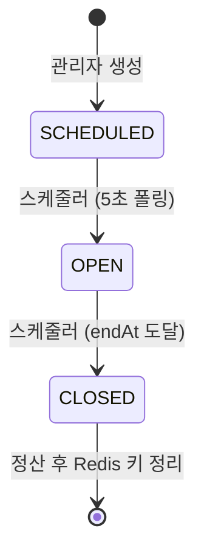
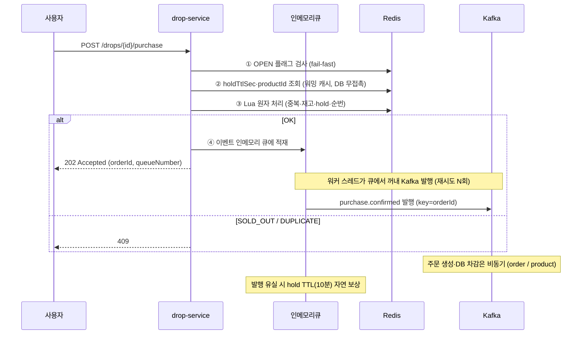

# drop-service

> 한정판 드롭 플랫폼의 **선착순 진입 관문**.
> 드롭 오픈 순간 폭주하는 트래픽을 Redis Lua 원자 연산으로 통제하고,
> 동기 응답(202) 이후의 처리는 Kafka로 비동기 위임합니다.

---

## 1. 책임 범위

| 담당 | 비담당 (다른 서비스) |
| --- | --- |
| 드롭 생성·일정·상태 전이 (`SCHEDULED → OPEN → CLOSED`) | 응모·추첨 → `raffle-service` |
| 선착순 진입 판정 (재고 선점, 1인 1구매, 대기 순번) | DB 확정 차감 → `product-service` |
| Redis 재고·hold 생명주기 (워밍 → 선점 → 회수) | 주문 상태 머신 → `order-service` |
| `drop.*`, `purchase.confirmed`, `hold.expired` 발행 | 결제·환불 → `payment-service` |
| (재고 복구만 담당, 쿠폰에 관여 안 함) | 쿠폰 상태·복구 → `coupon-service` |

> 설계 원칙: **드롭이 열려 있는 동안 재고의 진실은 Redis 하나.** DB는 사후 정산 원장이며, 드롭 진행 중 DB 재고를 실시간 조회하지 않는다.

---

## 2. 핵심 흐름

### 2-1. 드롭 생명주기



OPEN 전이는 반드시 다음 순서를 지킨다. 워밍 실패 시 OPEN으로 바꾸지 않고 다음 주기에 재시도한다.

```
① product-service 재고 스냅샷 조회
② Redis 워밍 (SETNX — 키 없을 때만 세팅, 멀티 인스턴스 재고 초기화 방지)
   stock:{dropId}      = totalQty
   drop:{dropId}:status = "OPEN"
   hold_ttl:{dropId}   = holdTtlSec   ← 진입 경로 DB 무접촉을 위한 캐싱
   product_id:{dropId} = productId    ← purchase.confirmed 이벤트 조립용 캐싱
③ 조건부 UPDATE (WHERE status='SCHEDULED')  ← 인스턴스가 여러 대여도 전이는 1회
④ drop.opened 발행
```

### 2-2. 선착순 진입 (`POST /drops/{id}/purchase`)



### 2-3. hold 생명주기 — 결제 vs TTL 만료 경합

선점 후 `holdTtlSec`(기본 600초 / 10분) 내 미결제 시 선점을 회수한다.
심판은 `ZREM` 반환값 — **먼저 지운 쪽이 승리**하며 별도 락이 필요 없다.

| 케이스 | 트리거 | 처리 |
| --- | --- | --- |
| 정상 결제 | `payment.completed` 수신 → 즉시 ZREM | 선점 확정 (정상 구매) |
| **결제 실패** | **`payment.failed` 수신 → 즉시 ZREM + INCR + SREM (Lua)** | **재고 즉시 복구 → 다음 사용자 선점 가능** |
| TTL 만료 (미결제) | TTL 폴링이 먼저 ZREM | 재고 INCR 복구 + `hold.expired` 발행 |
| 만료 후 결제 뒤늦게 완료 | ZREM=0 감지 | `refund.requested` 발행 → 자동 환불 |

> `payment.failed` 즉시 복구 근거: TTL(600초) 만료까지 대기하면 그 시간 동안 재고가 불필요하게 묶여 다른 사용자의 선점이 차단됨. 실패 이벤트 수신 즉시 복구하여 재고 가용성을 최대화한다.

---

## 3. API 명세

| Method | Path | 권한 | 설명 | 응답 |
| --- | --- | --- | --- | --- |
| POST | `/admin/drops` | ADMIN | 드롭 생성 (선착순 INSTANT 전용) | 201 |
| PUT | `/admin/drops/{dropId}` | ADMIN | 수정 — `SCHEDULED` 상태에서만 | 200 |
| DELETE | `/admin/drops/{dropId}` | ADMIN | 삭제 — `SCHEDULED` 상태에서만 (소프트딜리트) | 204 |
| GET | `/drops?status=&page=` | GUEST | 목록 (Look-aside 캐싱) | 200 |
| GET | `/drops/{dropId}` | GUEST | 상세 — 잔여 수량은 Redis 카운터로 응답 | 200 |
| POST | `/drops/{dropId}/purchase` | USER | **선착순 진입 (부하 테스트 대상)** | 202 |
| GET | `/drops/{dropId}/purchase/me` | USER | 내 접수 상태·대기 순번 (P2) | 200 |

진입 API 실패 코드: `DROP_NOT_OPEN`(409) · `SOLD_OUT`(409) · `DUPLICATE_PURCHASE`(409) · `DROP_NOT_FOUND`(404)

---

## 4. 데이터

### PostgreSQL (`drop_db` 스키마)

```sql
drops (
  drop_id      UUID         NOT NULL DEFAULT gen_random_uuid(),  -- PK
  product_id   UUID         NOT NULL,  -- FK 없는 ID 참조 (서비스 경계)
  status       VARCHAR(20)  NOT NULL DEFAULT 'SCHEDULED',  -- SCHEDULED | OPEN | CLOSED
  start_at     TIMESTAMPTZ  NOT NULL,
  end_at       TIMESTAMPTZ  NOT NULL,
  total_qty    INT          NOT NULL,
  hold_ttl_sec INT          NOT NULL DEFAULT 600,  -- 선점 유지 시간 (기본 10분)
  created_at   TIMESTAMPTZ  NOT NULL DEFAULT now(),
  created_by   UUID         NOT NULL,  -- 생성자 userId
  updated_at   TIMESTAMPTZ,
  updated_by   UUID,                   -- 수정자 userId
  deleted_at   TIMESTAMPTZ,            -- 소프트딜리트 일시 (NULL = 정상)
  deleted_by   UUID,                   -- 소프트딜리트 처리자 userId

  CONSTRAINT pk_drops          PRIMARY KEY (drop_id),
  CONSTRAINT chk_drops_status  CHECK (status IN ('SCHEDULED', 'OPEN', 'CLOSED')),
  CONSTRAINT chk_drops_qty     CHECK (total_qty > 0),
  CONSTRAINT chk_drops_period  CHECK (end_at > start_at)
)
-- INDEX (status, start_at), (status, end_at) : 스케줄러 폴링용
-- 래플은 raffle-service의 p_raffles 테이블로 완전 분리
-- BaseEntity 상속 + @SQLRestriction("deleted_at IS NULL"): JPA 쿼리에서 소프트딜리트 행 자동 제외

processed_events (
  event_id     VARCHAR(100) PK,  -- Consumer 멱등
  topic        VARCHAR(100) NOT NULL,
  processed_at TIMESTAMPTZ  NOT NULL DEFAULT now()
)
```

### Redis

| 키 | 타입 | 용도 | 생성 / 소멸 |
| --- | --- | --- | --- |
| `stock:{dropId}` | String | 남은 수량 카운터 | 워밍 SETNX / 정산 후 DEL |
| `purchased:{dropId}` | Set | 1인 1구매 차단 (userId) | Lua SADD / 정산 후 DEL |
| `holds:{dropId}` | ZSet | orderId → 만료 epoch | Lua ZADD / 결제·만료 시 ZREM |
| `queue:{dropId}` | String | 접수 순번 카운터 | Lua INCR / 정산 후 DEL |
| `drop:{dropId}:status` | String | OPEN 플래그 (fail-fast) | 전이 시 SETNX / 종료 시 즉시 DEL |
| `hold_ttl:{dropId}` | String | 선점 유지 시간(초) 캐시 | 워밍 SETNX / 정산 후 DEL |
| `product_id:{dropId}` | String | productId 캐시 (이벤트 조립용) | 워밍 SETNX / 정산 후 DEL |

---

## 5. Kafka

### 전체 이벤트 흐름 (프로젝트 공통)

| 토픽 | 발행 서비스 | 구독 서비스 | 트리거 |
| --- | --- | --- | --- |
| `drop.opened` | drop-service | notification-service | SCHEDULED → OPEN 전이 |
| `drop.closed` | drop-service | — | OPEN → CLOSED 전이 (raffle-service 자체 스케줄러로 독립 처리) |
| `purchase.confirmed` | drop-service | order-service | 선점 성공 |
| `hold.expired` | drop-service | order-service, coupon-service | TTL 만료 회수 |
| `refund.requested` | drop-service | payment-service | ZREM=0 감지 (만료 후 결제) |
| `payment.completed` | payment-service | drop-service, product-service, order-service, coupon-service | 결제 완료 (coupon: RESERVED→USED) |
| `payment.failed` | payment-service | drop-service, order-service, coupon-service | 결제 실패 (coupon: RESERVED→AVAILABLE) |
| `refund.done` | payment-service | coupon-service, notification-service | 환불 완료 (refundReason 분기: SYSTEM_STOCK_FAILED만 쿠폰 복구) |
| `stock.deducted` | product-service | order-service | DB 재고 확정 차감 완료 |
| `stock.failed` | product-service | drop-service, payment-service, order-service | DB 재고 차감 실패 |
| `order.created` | order-service | — | 주문 생성 |
| `order.confirmed` | order-service | notification-service | 주문 확정 |
| `order.cancelled` | order-service | notification-service | 주문 취소 |
| `order.shipped` | order-service | notification-service | 배송 시작 |
| `raffle.winner.selected` | raffle-service | order-service, product-service, notification-service | 추첨 당첨 |
| `raffle.loser.notified` | raffle-service | payment-service, notification-service | 추첨 낙첨 |
| `coupon.issued` | coupon-service | notification-service | 쿠폰 발급 |
| `coupon.used` | coupon-service | — | 쿠폰 사용 (RESERVED→USED 결과, 통계용) |

---

### drop-service 발행

| 토픽 | 파티션 키 (수) | 트리거 | payload |
| --- | --- | --- | --- |
| `drop.opened` | dropId (1) | 상태 전이 SCHEDULED → OPEN | `eventId`, `dropId`, `startAt`, `endAt`, `totalQty` |
| `drop.closed` | dropId (1) | 상태 전이 OPEN → CLOSED | `eventId`, `dropId` |
| `purchase.confirmed` | **orderId (3)** | 선점 성공 → 주문 생성 트리거 | `eventId`, `orderId`, `dropId`, `userId`, `productId`, `holdExpiresAt` |
| `hold.expired` | orderId (1) | TTL 만료 → 주문 취소 트리거 | `eventId`, `orderId`, `dropId` |
| `refund.requested` | orderId (1) | ZREM=0 감지 (만료 후 결제) → 자동 환불 트리거 | `eventId`, `orderId`, `userId`, `reason` |

> 모든 이벤트 payload 첫 필드에 `eventId` 포함 — Consumer가 `processed_events`로 멱등성 체크

### drop-service 구독

| 토픽 | 처리 | 멱등 |
| --- | --- | --- |
| `payment.completed` | ① `salesType != INSTANT` 스킵 ② ZREM holds → 반환값 1=정상·0=LATE_PAYMENT ③ ZREM=0이면 `refund.requested` 발행 | ZREM 자체가 멱등 |
| `payment.failed` | ① `salesType != INSTANT` 스킵 ② **즉시** ZREM + INCR + SREM 복구 (Lua) — TTL 대기 없이 재고 즉시 반환 | `processed_events` 필수 — INCR은 멱등이 아님 |
| `stock.failed` | 동일 복구 Lua (ZREM + INCR + SREM) — payment, order와 병렬 구독 | `processed_events` 필수 |

> `dropId` 전달 경로: `purchase.confirmed`(drop) → `order.created`(order) → `payment.completed` / `payment.failed`(payment) → drop 복구. RAFFLE은 `dropId`가 null이나 `salesType` 분기로 스킵.

---

## 6. 핵심 설계 결정 (ADR 요약)

| # | 결정 | 근거 |
| --- | --- | --- |
| 1 | 동시성 제어를 분산 락(Redisson)이 아닌 **Lua Script**로 | 락은 대기·재시도 오버헤드 발생. 단일 스레드 Redis에서 Lua는 락 없이 원자성 확보 |
| 2 | `purchase.confirmed` 파티션 키를 dropId가 아닌 **orderId**로 | 트래픽이 단일 인기 드롭에 집중 → dropId 키는 핫 파티션(병렬성 0). 순서 보장은 포기하되 정합성은 멱등 처리 + DB가 담당 |
| 3 | 진입 API에 **DB Outbox 미적용 → 인메모리 아웃박스 워커** 채택 | 진입 경로가 DB 무접촉이라 DB Outbox는 오히려 DB I/O 추가 및 병목 재발생. 대신 인메모리 큐 + 워커 스레드로 재시도를 보장하여 DB 무접촉 원칙을 유지하면서 발행 안정성 확보. 발행 최종 유실 시 hold TTL(10분)이 자연 보상 |
| 4 | TTL 감지를 Keyspace Notification이 아닌 **폴링**으로 | 만료 이벤트는 유실 가능성 존재. 폴링은 재실행 가능해 견고하며, hold.expired Consumer 멱등이 전제 |
| 5 | 상태 전이를 **조건부 UPDATE**로 멱등화 | 스케줄러 다중 인스턴스 환경에서도 전이·워밍·발행이 정확히 1회 |
| 6 | `payment.failed` 수신 시 **TTL 대기 없이 즉시 복구** | TTL(600초) 대기 시 그 시간 동안 재고 불필요하게 차단. 즉시 ZREM+INCR+SREM으로 재고 반환 → 다음 사용자 선점 가능 시간 최소화 |
| 7 | order-service에 **no-op 처리 협의** | 인메모리 아웃박스 사용으로 극히 드문 경우 purchase.confirmed 유실 가능. order-service가 ① purchase.confirmed 멱등 처리 ② hold.expired 수신 시 주문 없으면 no-op 처리하도록 협의 완료 |
| 8 | **INSTANT / RAFFLE 테이블 분리** | drop_type 컬럼으로 통합 시 RAFFLE 전용 컬럼(winner_count 등)이 INSTANT 행에 NULL로 쌓이고, 래플 담당자(raffle-service)와 스키마 소유권이 충돌. 드롭서비스는 INSTANT 전용 `drops` 테이블만 소유하고, 래플은 raffle-service의 `raffles` 테이블로 완전 분리 |

---

## 7. 부하 테스트

- 대상: `POST /drops/{dropId}/purchase`
- 조건: 스레드 100 · Ramp-up 1초 · 루프 10 (요청 1,000건)
- 측정 환경: `(기입: 로컬/Docker, CPU n코어, 메모리 nGB, DB·Kafka 동일 머신 여부)`

| 버전 | 구현 | 처리량 (req/s) | 평균 응답 (ms) | 오류율 |
| --- | --- | --- | --- | --- |
| v1 | DB 비관적 락 | `(측정)` | `(측정)` | `(측정)` |
| v2 | Redis Lua | `(측정)` | `(측정)` | `(측정)` |

> 개선 요약: `(무엇을 바꿔서 어떤 지표가 어떻게 변했는지 1~3줄)`

---

## 8. 실행

```bash
# 인프라 (프로젝트 루트)
docker compose up -d        # kafka(9092), redis, postgresql, kafka-ui(8989)

# 서비스
./gradlew :drop-service:bootRun
```

| 환경 변수 | 기본값 |
| --- | --- |
| `SPRING_DATASOURCE_URL` | `jdbc:postgresql://localhost:5432/drop_db` |
| `SPRING_KAFKA_BOOTSTRAP_SERVERS` | `localhost:9092` |
| `SPRING_DATA_REDIS_HOST` | `localhost` |

---

## 9. 패키지 구조

```
drop-service
└── src/main/java/com/team/drop
    ├── presentation     # Controller, 요청/응답 DTO
    ├── application      # DropService, PurchaseService, 스케줄러
    ├── domain           # Drop 엔티티, DropStatus, 도메인 규칙
    └── infrastructure   # Redis(Lua), Kafka Producer/Consumer, Repository 구현
```
