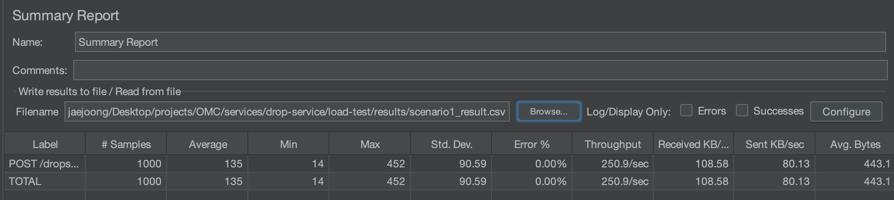
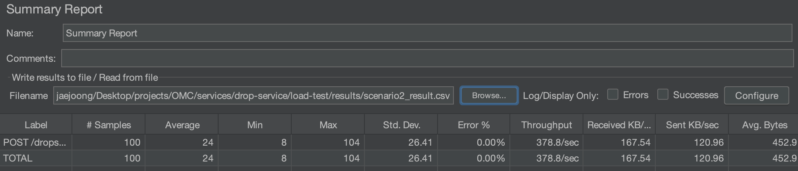
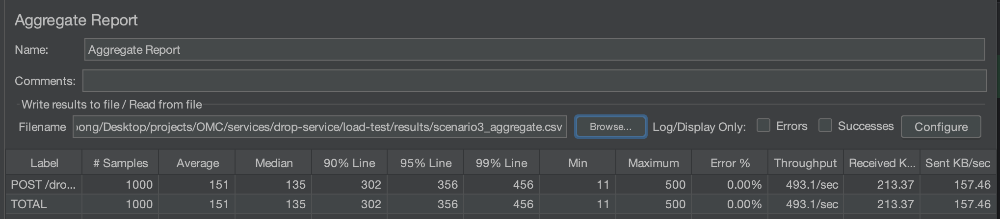

# Drop Service 부하 테스트

## 폴더 구조

```
load-test/
├── scenario1_accuracy.jmx     # 재고 정확성 — 1000명 경쟁, 100명만 성공
├── scenario2_duplicate.jmx    # 중복 방지 — 같은 userId 10회 반복
├── scenario3_performance.jmx  # 성능 측정 — TPS·응답시간·p99
├── data/
│   ├── users.csv              # 고유 userId 1000개 (시나리오 1·3)
│   └── users10.csv            # 고유 userId 10개 (시나리오 2 중복 방지)
├── scripts/
│   └── redis-reset.sh         # 테스트 전 Redis 초기화
└── results/                   # 결과 CSV 저장 (gitignore)
```

## 사전 조건

- JMeter 5.6+ 설치
- drop-service 실행 중
- Redis·Kafka 실행 중
- 테스트할 OPEN 상태의 드롭 생성 완료

## 실행 방법

### 1. Redis 초기화 (매 테스트 전 필수)

```bash
cd load-test
./scripts/redis-reset.sh <dropId> [stock] [host] [port]

# 예시
./scripts/redis-reset.sh 550e8400-e29b-41d4-a716-446655440000 100
```

### 2. JMeter CLI 실행

```bash
# 시나리오 1 — 재고 정확성
jmeter -n -t scenario1_accuracy.jmx \
  -JdropId=<dropId> \
  -Jhost=localhost \
  -Jport=8082 \
  -JgatewaySecret=local-secret \
  -JcsvPath=data/users.csv \
  -l results/scenario1_result.csv

# 시나리오 2 — 중복 방지 (10개 userId 순환)
jmeter -n -t scenario2_duplicate.jmx \
  -JdropId=<dropId> \
  -Jhost=localhost \
  -Jport=8082 \
  -JgatewaySecret=local-secret \
  -JcsvPath=data/users10.csv \
  -l results/scenario2_result.csv

# 시나리오 3 — 성능 측정 (Redis 리셋 후 실행)
jmeter -n -t scenario3_performance.jmx \
  -JdropId=<dropId> \
  -Jhost=localhost \
  -Jport=8082 \
  -JgatewaySecret=local-secret \
  -JcsvPath=data/users.csv \
  -l results/scenario3_result.csv
```

### 3. 결과 검증

```bash
# 시나리오 1·3 — 재고 정확성·성능
redis-cli GET stock:<dropId>           # 0 이어야 함
redis-cli SCARD purchased:<dropId>     # 100 이어야 함
redis-cli ZCARD holds:<dropId>         # 결제 완료/만료 후 0

# 시나리오 2 — 중복 방지
redis-cli GET stock:<dropId>           # 90 이어야 함 (10명 성공)
redis-cli SCARD purchased:<dropId>     # 10 이어야 함 (10개 userId, 중복 없음)
redis-cli ZCARD holds:<dropId>         # 10
```

### 4. 성능 결과 확인 (시나리오 3)

```bash
# JMeter GUI에서 Aggregate Report로 열기
jmeter
# File → Open → results/scenario3_aggregate.csv
# Aggregate Report 탭에서 TPS·p90·p99 확인
```

## 검증 기준

| 시나리오 | 기대 결과 |
| --- | --- |
| 1 재고 정확성 | 202 == 100, 409(SOLD_OUT) == 900, 5xx == 0 |
| 2 중복 방지 | 202 == 10, 409(DUPLICATE_PURCHASE) == 90, purchased SCARD == 10 |
| 3 성능 | 202 == 100, 409 == 900, 5xx == 0 + TPS·p99 측정 |

## 실제 테스트 결과

| 시나리오 | 202 | 409 | 5xx | 평균 응답 | 최소 | 최대 |
| --- | --- | --- | --- | --- | --- | --- |
| 1 재고 정확성 | 100 | 900 | 0 | 996ms | 524ms | 1635ms |
| 2 중복 방지 | 10 | 90 | 0 | — | — | — |
| 3 성능 | 100 | 900 | 0 | 152ms | 11ms | 500ms |

### 시나리오 1 — 재고 정확성


### 시나리오 2 — 중복 방지


### 시나리오 3 — 성능 측정


## 주의사항

- **409는 정상 응답** — SOLD_OUT·DUPLICATE_PURCHASE 모두 의도된 결과
- **5xx만 에러** — JMeter Response Assertion이 202·409를 성공으로 처리하도록 설정됨
- **매 테스트 전 Redis 리셋 필수** — 리셋 없이 2회차 실행 시 전부 SOLD_OUT
- **userId는 X-User-Id 헤더로 주입** — Gateway(8080) 아닌 drop-service(8082) 직접 호출
- **시나리오 2는 users10.csv 사용** — 10개 userId 순환으로 중복 구매 재현
